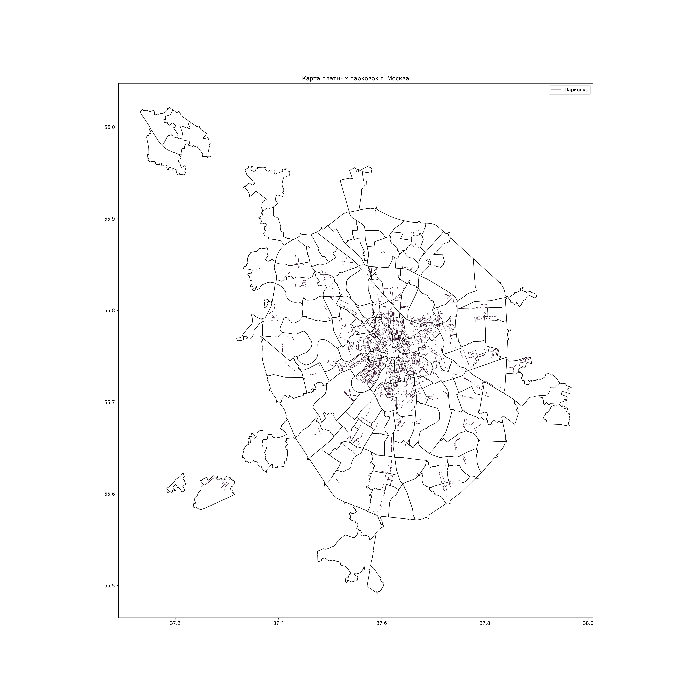

# Moscow Street Parkings Visualization 

## About
The project was made in personal purposes to check visualization powers of matplotlib.pyplot and plotly. 

The commit contains all the project code, excluding personal API key for data collection. Though, anyone can get the jey for free [here](https://apidata.mos.ru/Account/Login). 

## Visualization 

The project contains two visualizations of the same data. 

### matplotlib.pyplot


For the process of creation see [the code](pyplot_visualization/static.py). 

### plotly 

<iframe src="results/interactive_graph.html"></iframe>

See the [file](results/interactive_graph.html), you can also see the [code](plotly_visualization/interactive.py).

## Data 

The data, that was used in the project, was gathered from the open sourses, such as [git repository](https://github.com/codeforgermany/click_that_hood/blob/main/LICENSE) and the [Moscow governments open data web-portal](https://data.mos.ru/opendata/7704786030-platnye-parkovki-na-ulichno-dorojnoy-seti).

## Usage 

Though the code was made in specific purpose, some of it can be modified reproduced by other programmists in accordance with their personal needs. The whole code can be used as a tolerable example of data map visualisation made with Python. 

Before starting any code, make sure you have checked the [requirements](requirements.txt) (they were generated automatically with `pip freeze`).

## Repository structure 

```
moscowStreetParking
├── data
│   ├── moscow_regions.geojson
│   └── moscow_parkings.geojson
├── data_collection
│   ├── __init__.py
│   ├── MOS_API_KEY.txt *
│   ├── api_setup.py
│   ├── gather_data.py
│   └── runpackage.py
├── plotly_visualization
│   ├── data
│   │   ├── parkings_big.csv
│   │   ├── parkings_medium.csv
│   │   ├── parkings_small.csv
│   │   ├── parkings_tiny.csv
│   │   ├── quantiles.json
│   │   └── regs.csv
│   ├── data_preparation.py
│   └── interactive.py
├── pyplot_visualization
│   └── static.py
├── results
│   ├── interactive_graph.html
│   └── static_graph.png
├── .gitignore
├── README.md
└── requirements.txt

6 directories, 21 files 

*  - not in commit 
```